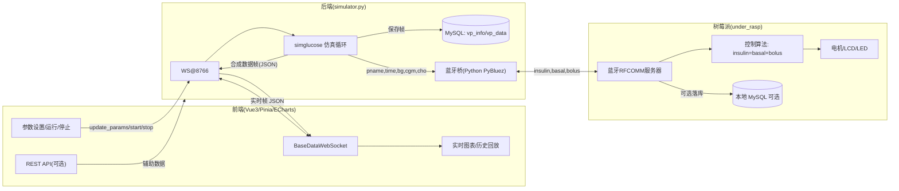
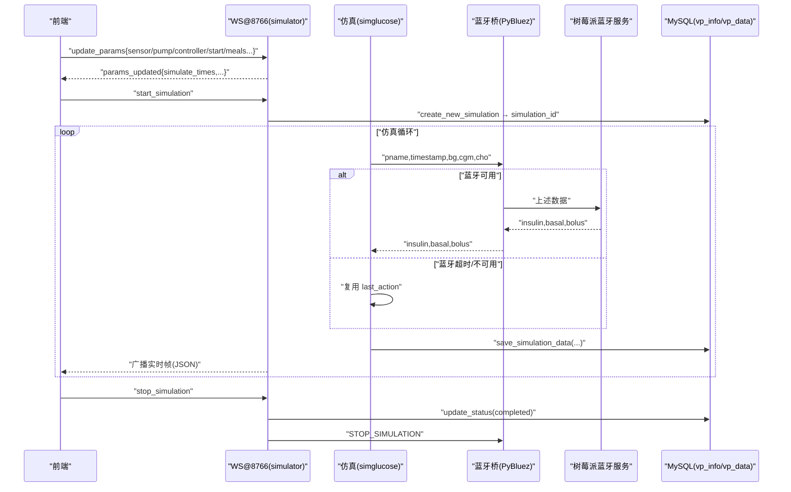

ddd_database_fb/
# DAPS Patient Monitor

全面的血糖监控与虚拟患者仿真套件。前端基于 Vue 3、Pinia、Element Plus 与 ECharts，后端由 Python `asyncio` 服务、`websockets` 和 `simglucose` 仿真引擎驱动，并使用 MySQL 存储仿真结果。该系统面向实时监控、参数化仿真、历史数据回放和患者管理等场景。

## 1. 系统概览

- **前端**：提供登录、患者列表、真实/虚拟患者监控、仿真历史浏览等界面。实时数据通过 WebSocket 推送，辅助信息通过 REST API 获取，使用 Pinia 保存用户会话和最新数据快照。
- **后端**：`simulator.py` 启动 WebSocket 服务器，接收前端命令、运行 `simglucose` 虚拟患者模型，推送 BG/CGM/Insulin 等时间序列，同时将数据写入 MySQL（`vp_info`、`vp_data`）。`database.py` 负责连接池与数据访问。
- **外围服务**：`src/api/request.js` 中的 REST 端点默认指向 `http://localhost:5000/api`（可通过 `VITE_API_BASE_URL` 修改），用于患者、仿真以及生命体征信息的增删改查。若后端暂不可用，登录模块内置本地 mock 账号（`admin / admin123`）。

### 核心处理流程（虚拟患者仿真）

1. 用户在 `VPatientsMonitor.vue` 中配置传感器、控制器、餐食计划和开始时间，点击“运行仿真”。
2. 前端 `BaseDataWebSocket` 客户端先发送 `update_params`，随后发送 `start_simulation` 命令至 `ws://localhost:8766`。
3. `backend/simulator.py` 解析参数、创建 `simglucose` 环境、生成仿真记录（`vp_info`），并把实时数据帧写入 `vp_data` 表，同时经 WebSocket 广播给所有客户端。
4. 前端 `handleBaseDataMessage` 将流式数据映射到 24 小时时间轴、更新 ECharts 折线图，并保留窗口内的历史点。
5. 用户可随时通过“停止仿真”触发 `stop_simulation`，后端更新状态并保持数据库记录；前端可进入历史模式使用滑块回看。

### 目录概览

```

├── src/                     # Vue 3 前端
│   ├── api/                 # REST/WebSocket 客户端
│   ├── components/          # Header / Sidebar 等共享组件
│   ├── router/              # 路由与导航守卫
│   ├── store/               # Pinia 状态容器（用户、患者）
│   ├── styles/              # 全局样式（SCSS）
│   └── views/               # 功能页面（登录、监控、仿真、列表）
├── backend/                 # Python 服务端
│   ├── simulator.py         # WebSocket 主入口 + simglucose 仿真
│   ├── database.py          # aiomysql 连接池 & CRUD
│   ├── bluetooth_client.py  # 蓝牙桥接，向树莓派推送实时数据
│   ├── base.py/222.py       # 早期/实验性脚本（保留参考）
│   └── simglucose/          # 第三方仿真库源码（控制器、模型、传感器等）
├── scripts/                 # 辅助脚本
├── public/, index.html      # Vite 静态资源
├── package.json             # 前端依赖
├── backend/requirements.txt # 后端依赖清单
└── *.md                     # 详细实现、测试、缺陷修复说明
```

### 目录树（注释版）

```
ddd_database_fb/
├── src/                                               # Vue 3 前端源代码
│   ├── api/                                           # 前端通信层：REST/WS 封装与统一入口
│   │   ├── request.js                                 # axios 单例：配置 baseURL、超时、JSON 头；请求拦截器附加 token；响应拦截器统一处理 401/错误弹窗
│   │   ├── index.js                                   # REST API 聚合：导出 auth/patients/glucose/other/simulation 等方法；auth 内置本地 mock 回退逻辑
│   │   └── websocket.js                               # 通用 WebSocketClient + BaseDataWebSocket（直连 ws://localhost:8766）
│   │                                                   # - 自动重连（退避间隔）、事件回调注册、消息路由
│   │                                                   # - 历史缓存窗口（用于回放/滑块），提供 get/delete/list/data 等命令方法
│   ├── components/                                    # UI 公共组件
│   │   ├── Header.vue                                 # 顶栏：标题/用户信息/退出登录（清理 store+跳转登录）
│   │   └── Sidebar.vue                                # 侧栏：模块导航菜单（与路由联动高亮）
│   ├── router/                                        # 路由与导航守卫
│   │   └── index.js                                   # 定义各视图路由；beforeEach 守卫校验登录态，未登录跳转 /login
│   ├── store/                                         # Pinia 仓库：应用状态中心
│   │   └── index.js                                   # useUserStore/usePatientsStore：token、用户资料、当前患者、实时帧缓冲、参数草稿、历史模式开关等
│   ├── styles/                                        # 全局样式
│   │   └── global.scss                                # 主题变量、布局、滚动与图表容器尺寸等基础样式
│   ├── views/                                         # 业务页面
│   │   ├── Login.vue                                  # 登录页：调用 /auth/login；失败回退本地 mock（admin/admin123）；持久化 token
│   │   ├── Choose.vue                                 # 入口页：快捷卡片导航至监控/仿真/列表等模块
│   │   ├── VPatientsMonitor.vue                       # 虚拟患者监控：参数/餐食设置；连接 BaseDataWebSocket 收流
│   │   │                                               # - 操作：保存参数(update_params)/开始(start)/停止(stop)
│   │   │                                               # - 图表：BG/CGM、CHO/COB、INSULIN/IOB 多图联动；24h 滚动窗口；历史回放滑块
│   │   ├── TruePatientsMonitor.vue                    # 真实患者监控：结构与虚拟页一致，REST 数据留作对接点
│   │   ├── SimulationsList.vue                        # 仿真列表：通过 WS get_simulations_list 拉取；支持回放 get_simulation_data、删除 delete_simulation
│   │   └── TestSimulation.vue                         # 实验/沙箱页：嵌入外部调试或验证特性用
│   ├── main.js                                        # 应用入口：创建 App，安装 Pinia、Router、Element Plus 并挂载
│   └── App.vue                                        # 根组件：布局骨架（Sidebar + Header + RouterView）
│
├── backend/                                           # Python 后端服务
│   ├── simulator.py                                   # 核心：WebSocket@8766 服务 + 仿真主循环
│   │                                                   # - 命令：update_params/start_simulation/stop_simulation/get_simulations_list/get_simulation_data/delete_simulation
│   │                                                   # - 仿真：simglucose 组件组合（患者/传感器/泵/控制器），步长约 3 分钟/帧
│   │                                                   # - 数据：创建 vp_info → 写入 vp_data → 广播实时帧至所有客户端
│   │                                                   # - 外设：调用 bluetooth_client 将 (pname,time,bg,cgm,cho) 发至树莓派并接收 (insulin,basal,bolus)
│   ├── database.py                                    # 数据访问层：aiomysql 连接池与 CRUD
│   │                                                   # - ensure_tables：自动建/迁移 vp_info、vp_data；兼容历史缺失字段
│   │                                                   # - create_new_simulation：创建仿真并按 patient_type 生成 VP/TP 前缀的 patient_id
│   │                                                   # - save_simulation_data / get_* / delete_simulation 等
│   ├── bluetooth_client.py                            # 蓝牙桥（PyBluez RFCOMM）：从环境变量 BLUETOOTH_TARGET_ADDRESS 取目标地址，默认端口 2
│   │                                                   # - 文本行协议：发送 "pname,time,bg,cgm,cho"；接收 "insulin,basal,bolus"；后台线程/队列/断线重连/超时
│   ├── base.py                                        # 旧版/演示：通过 WS 推送简单正弦数据（保留参考）
│   ├── 222.py                                         # 实验性脚本：历史留存
│   ├── DATABASE_SETUP.md                              # 初始化 SQL 示例（命名可能与现实现不同；以 database.py 的 DB_CONFIG/表结构为准）
│   ├── requirements.txt                               # 后端依赖：websockets/aiomysql/pymysql/pybluez/simglucose 等
│   └── simglucose/                                    # 第三方仿真库源码：患者模型、控制器、传感器、仿真环境等
│
├── scripts/
│   └── check_divs.py                                  # 小工具：检查 HTML 中 <div> 标签配对，演示用途
│
├── public/
│   └── logo.png                                       # 静态资源示例
│
├── ws_demo.html                                       # WebSocket 调试页：可手动连接 ws://localhost:8766 发送/接收消息
├── vite.config.js                                     # Vite 配置：dev 端口 3001；alias '@' → 'src'；开发服务器设置
├── package.json                                       # 前端脚本与依赖：npm run dev/build/preview
├── requirements.txt                                   # 根层占位；请以 backend/requirements.txt 为准
└── README.md                                          # 本说明文件：运行方式/端口/协议/数据库/流程图等
```

### 模块清单与作用一览

- 后端（backend）
  - simulator.py：主 WebSocket 服务与仿真循环，广播实时数据帧；调用 simglucose；写入 MySQL；经蓝牙桥接树莓派获取控制量
  - database.py：aiomysql 连接池；自动建表（vp_info、vp_data）；提供仿真 CRUD（创建、保存帧、列表、查询、删除）
  - bluetooth_client.py：PyBluez RFCOMM 客户端（后台线程），向树莓派发送“pname,time,bg,cgm,cho”并接收“insulin,basal,bolus”；支持断线重连与超时
  - base.py / 222.py：早期/演示脚本（保留参考），当前以 simulator.py 为主
  - simglucose/：仿真库源码（患者模型、控制器、传感器等）
- 前端（src）
  - api/websocket.js：通用 WebSocketClient 与 BaseDataWebSocket（直连 ws://localhost:8766，带重连与历史缓存）
  - api/request.js：axios 实例（默认 baseURL=VITE_API_BASE_URL 或 http://localhost:5000/api），自动携带 token，401 退出
  - api/index.js：REST API 聚合（auth 含本地 mock 回退）
  - views/VPatientsMonitor.vue：虚拟患者监控（参数设置、餐食配置、BG/CGM/CHO/COB/INSULIN/IOB 实时图与历史回放）
  - views/TruePatientsMonitor.vue：真实患者监控（布局与交互类似）
  - views/SimulationsList.vue：通过 WS 查询/回放/删除仿真
  - views/Login.vue / Choose.vue / TestSimulation.vue：登录、入口选择、实验页
  - components/Header.vue / Sidebar.vue：通用布局组件
  - router/index.js：路由与导航守卫
  - store/index.js：Pinia 仓库（用户、患者与实时数据）

### 文件速查表（精选）

- 根目录
  - vite.config.js：Vite 开发端口 3001，@ 别名映射 src
  - package.json：前端依赖与脚本（npm run dev / build / preview）
  - ws_demo.html：WebSocket 调试样页
  - requirements.txt（空）：请以 backend/requirements.txt 为准
- backend/
  - simulator.py（启动入口）：python backend/simulator.py → ws://localhost:8766
  - database.py：默认连接数据库名 2patients_datas（可按需调整 DB_CONFIG）
  - bluetooth_client.py：读取 BLUETOOTH_TARGET_ADDRESS 环境变量以连接树莓派 RFCOMM 端口 2
  - DATABASE_SETUP.md：数据库初始化参考（与实际 DB_CONFIG 可能不同，以代码为准）
  - requirements.txt：后端依赖清单（simglucose、aiomysql、websockets、pybluez 等）
- src/
  - api/websocket.js：WebSocket 客户端与 BaseDataWebSocket
  - api/request.js / api/index.js：REST 客户端与接口聚合
  - views/*.vue：页面
  - router/index.js：路由与守卫
  - store/index.js：Pinia 仓库
  - styles/global.scss：全局样式
  - main.js / App.vue：应用入口

## 2. 前端模块详解

- **入口 (`main.js`, `App.vue`)**：注册 Element Plus、Pinia、Router；应用级布局由 `Sidebar`（左侧导航）和 `Header`（用户信息）组成。
- **认证 (`Login.vue`)**：优先调用后端 `/auth/login`；失败后回退至本地 mock 账号。登录成功后持久化 token 和用户资料。
- **导航 (`router/index.js`)**：定义登录、患者列表、真实/虚拟监控、仿真记录、测试仿真等路由，并设置登录守卫。
- **状态 (`store/index.js`)**：
  - `useUserStore` 负责 token、用户资料、持久化恢复。
  - `usePatientsStore` 保存当前患者、实时数据缓冲、仿真参数草稿。
- **实时监控视图**：
  - `TruePatientsMonitor.vue`：展示真实患者指标（依赖 REST/外部数据），结构与虚拟监控一致。
  - `VPatientsMonitor.vue`：系统最复杂页面，集成参数面板、实时图表（BG/CGM、CHO/COB、INSULIN/IOB）、历史模式、餐食计划编辑和 WebSocket 交互。
- **辅助视图**：`TotalPatientsList.vue`（患者管理）、`SimulationsList.vue`（从 WebSocket 请求仿真元数据列表）、`Choose.vue`（模块选择）、`TestSimulation.vue`（实验页）。
- **API 与通信**：
  - `api/request.js`：封装 axios，自动附加 Bearer token，401 时清理本地状态并跳转登录。
  - `api/websocket.js`：抽象通用 WebSocket 客户端与 `BaseDataWebSocket`，带断线重连、消息分发、历史缓存等能力。

## 3. 后端模块详解

- **`simulator.py`**：
  - 监听 `ws://localhost:8766`，接收 `start_simulation`、`stop_simulation`、`update_params`、`get_simulations_list`、`get_simulation_data`、`delete_simulation` 等命令。
  - 使用 `simglucose` 组件（患者模型、CGM 传感器、泵、控制器）生成 3 分钟间隔的血糖动态数据；支持随机餐食与自定义餐食场景。
  - 通过 `database.py` 将仿真元信息写入 `vp_info`，将序列帧写入 `vp_data`，字段包括：`time`, `bg`, `cgm`, `cho`, `cob`, `insulin`, `basal`, `bolus`, `iob`, `bg_prev` 等。
  - 使用 `asyncio.create_task(simulator())` 并行运行仿真循环与 WebSocket 服务；支持多客户端订阅。
- **`database.py`**：
  - 使用 `aiomysql.create_pool` 管理连接池。
  - `ensure_tables()` 自动创建/迁移 `vp_info`、`vp_data`；并兼容历史版本缺失字段。
  - 提供异步 CRUD：`create_new_simulation`, `save_simulation_data`, `get_all_simulations`, `get_simulation_data`, `delete_simulation` 等。
- **`bluetooth_client.py`**：封装 PyBluez RFCOMM 客户端，根据 `BLUETOOTH_TARGET_ADDRESS` 环境变量连接树莓派，后台线程逐条发送仿真帧（`patient,time,cgm,cho,basal,bolus,insulin`），并在停止仿真时广播 `STOP_SIMULATION`。
- **`base.py`, `222.py`**：早期或替代实现，分别用于正弦演示数据和通过 REST 推送数据；现行主流程集中在 `simulator.py`。
- **依赖**：详见 `backend/requirements.txt`，包含 `simglucose`, `aiomysql`, `websockets` 等。

### 数据库结构（自动创建）

- `vp_info`: 存储每次仿真元信息（开始时间、患者标签、传感器/泵/控制器类型、仿真时长、数据点数量、患者画像字段、状态等）。`patient_id` 会根据 `patient_type` 自动生成 `VP###` 或 `TP###` 前缀。
- `vp_data`: 保存实时帧。目前代码仅建立了 `id` 的二级索引 `idx_id`，未设置主键；推荐为 `(id, time)` 建立复合索引（或唯一键）以避免重复并优化按时间排序的查询。

## 4. 系统工作流程

### 4.1 启动

1. 启动 MySQL 并确保数据库与账号信息与 `backend/database.py` 中的 `DB_CONFIG` 一致。
2. 执行 `pip install -r backend/requirements.txt` 安装后端依赖。
  - 若需同步树莓派，请先为当前终端设置 `BLUETOOTH_TARGET_ADDRESS`（示例：Windows `set BLUETOOTH_TARGET_ADDRESS=DC:A6:32:12:34:56`，macOS/Linux `export BLUETOOTH_TARGET_ADDRESS=DC:A6:32:12:34:56`）。
3. 运行 `python backend/simulator.py`，控制台会显示 `Base数据服务器启动在 ws://localhost:8766`，并尝试连接蓝牙目标设备。
4. 在另一个终端中运行前端：

   ```bash
   npm install
   npm run dev
   ```

5. 浏览器访问 `http://localhost:3001`（Vite 开发端口见 vite.config.js）。若后端 REST 服务暂未部署，可使用默认账号 `admin / admin123` 登录。

### 4.2 日常使用

1. 登录后进入 `选择页面`，进入虚拟患者监控或其它模块。
2. 在虚拟患者监控页：
   - 选择患者模型（adult/adolescent/child）、传感器、泵、控制器。
   - 设置开始时间（精确到秒）以及仿真时长（小时）。
   - 在“餐食设置”中选择随机或自定义模式（每日重复或完全自定义时间点）。
   - 点击“保存参数”将配置同步到后端；点击“运行仿真”启动实时仿真。
3. 图表实时刷新，横轴覆盖固定 24 小时窗口，并在达到末端后平移。
4. 点击“停止仿真”后，历史数据会保存至 `historyMode`，可通过滑块逐帧查看。
5. 在“仿真列表”页面，可通过 WebSocket 查询 `vp_info` 记录并选择某次仿真回放或删除。

### 4.3 REST API 配置

- 修改 `src/api/request.js` 或创建 `.env` 文件定义 `VITE_API_BASE_URL` 指向实际 REST 服务。
- 目前仓库不提供 REST 服务实现，但前端已针对 `/patients`, `/glucose-data`, `/other-data`, `/simulation`, `/auth` 等端点做好封装。可根据实际后端返回格式调整。

## 5. 构建与部署

- **前端生产构建**：`npm run build`（输出默认到 `dist/`）。部署前请确保全局安装 `vue-cli-service` 或将脚本改为 `vite build`。
- **后端部署建议**：使用 `python backend/simulator.py` 或将其封装为系统服务。需提前准备：
  - Python 3.10+
  - MySQL 8.x 并初始化数据库
  - 依赖安装与 `.env`（如需配置 DB 凭据，可扩展 `database.py` 读取环境变量）
- **日志与监控**：后端使用 Python logging 输出至标准输出，可根据需要接入文件或集中日志系统。

## 6. 常见问题

- **WebSocket 连接失败**：确认模拟器已运行，端口 8766 未被占用，且浏览器与服务器处于同一网络。`BaseDataWebSocket` 支持断线重连，将在 3 秒后重试。
- **蓝牙桥未启用**：若日志提示 “Bluetooth bridge disabled” 或重复连接失败，请确认已安装 `pybluez`（Windows 需额外的 Bluetooth 驱动支持）并设置 `BLUETOOTH_TARGET_ADDRESS` 环境变量。
- **前端构建提示找不到 `vue-cli-service`**：该仓库默认使用 Vite，如需使用 Vue CLI，请安装依赖或将 `npm run build` 脚本替换为 `vite build`。
- **数据库未创建**：首次运行 `simulator.py` 时 `ensure_tables()` 会自动建表，若因权限不足失败，请手动执行 `backend/DATABASE_SETUP.md` 中的语句。
- **REST 接口 401**：后端未实现认证时，可暂时依赖本地 mock，或在 REST 服务中实现对应端点。

## 7. 参考文档

- `DETAILED_IMPLEMENTATION_GUIDE.md`：完整开发细节。
- `PARAMETER_INTEGRATION_REPORT.md`、`项目分析与改进总结.md`：阶段性总结与集成说明。
- `数据库和图表配置修复说明.md`、`滚动时间窗口功能说明.md` 等：针对特性或问题的专项记录。
- `backend/DATABASE_SETUP.md`：数据库初始化脚本。

补充：端到端交互与蓝牙协议、字段说明与时序图，详见根目录《项目架构与交互逻辑梳理.md》。

欢迎通过 Issue 或 PR 提交改进建议。祝使用顺利！
  - 日志记录

---

## 8. 数据库结构设计详解

本节以实际后端实现（`backend/database.py`）为准，系统采用 MySQL 存储仿真“元信息 + 时序数据”。核心两张表：`vp_info`（一次仿真一次记录）与 `vp_data`（每条时间帧一行）。未启用外键约束，依赖应用层保证一致性。

### 8.1 物理表结构与字段

- 表 `vp_info`（一次仿真的元信息）
  - id: INT, AUTO_INCREMENT, PRIMARY KEY（仿真 ID，也是 `vp_data.id` 的外键含义）
  - start_time: DATETIME, NOT NULL（仿真开始时间）
  - person: VARCHAR(100)（操作者/标注）
  - patient_id: VARCHAR(50)（展示用的“VP###/TP###”，由应用层根据 patient_type 自动生成并回写）
  - patient_name: VARCHAR(100)（患者姓名或标签，可空）
  - patient_type: VARCHAR(50)（“虚拟/真实/VP/TP”等，决定前缀）
  - patient_age: INT
  - patient_gender: VARCHAR(20)
  - patient_blood_type: VARCHAR(10)
  - sensor: VARCHAR(50), pump: VARCHAR(50), controller: VARCHAR(50)
  - simulate_hours: INT（预计时长）
  - simulate_times: INT（步数或采样次数的规划值）
  - data_count: INT DEFAULT 0（已采集帧计数，应用层在每次写入帧后自增）
  - created_at: DATETIME DEFAULT CURRENT_TIMESTAMP
  - updated_at: DATETIME DEFAULT CURRENT_TIMESTAMP ON UPDATE CURRENT_TIMESTAMP
  - status: VARCHAR(20) DEFAULT 'running'（'running' | 'completed' 等）

- 表 `vp_data`（仿真时序数据，每帧一行）
  - id: INT NOT NULL（仿真 ID，逻辑上指向 `vp_info.id`）
  - patient_id: VARCHAR(50)（冗余存储，便于直接展示）
  - time: DATETIME（时间戳，建议 NOT NULL）
  - bg: DECIMAL(5,2)、cgm: DECIMAL(5,2)、bg_prev: DECIMAL(5,2)
  - cho: DECIMAL(5,2)、cob: DECIMAL(5,2)
  - insulin: DECIMAL(6,3)、basal: DECIMAL(6,3)、bolus: DECIMAL(6,3)、iob: DECIMAL(6,3)
  - 索引：KEY idx_id (id)
  - 约束：当前未设置主键/唯一键（允许同一 id 下重复 time 行）；推荐添加 `(id, time)` 唯一键或主键

关系说明：`vp_data.id` 多对一 `vp_info.id`，未显式外键；删除仿真时应用层先删 `vp_data` 再删 `vp_info`（见 `delete_simulation`）。

### 8.2 写入/读取路径（与代码映射）

- 创建仿真：`create_new_simulation(...)` → 插入 `vp_info`，获取自增 id；根据 `patient_type` 生成 `patient_id`（前缀 VP/TP + 左填零序号），随后回写。
- 写入帧：`save_simulation_data(...)` → 向 `vp_data` 插入一行，同时 `vp_info.data_count = data_count + 1`。
- 更新状态：`update_simulation_status(id, status)`。
- 查询列表：`get_all_simulations()` → 从 `vp_info` 拉取元数据（ORDER BY id DESC）。
- 查询单次数据：`get_simulation_data(id)` → 从 `vp_data` 按 time 升序取全量帧。
- 查询单次元信息：`get_simulation_info(id)`。
- 删除：`delete_simulation(id)` → 先删 `vp_data` 再删 `vp_info`。

### 8.3 常用查询示例

- 最近 200 帧（某次仿真）：
  - SELECT id, patient_id, time, bg, cgm, cho, cob, insulin, basal, bolus, iob FROM vp_data WHERE id = ? ORDER BY time DESC LIMIT 200;

- 指定时间窗：
  - SELECT * FROM vp_data WHERE id = ? AND time BETWEEN ? AND ? ORDER BY time ASC;

- 聚合统计（按日平均 BG）：
  - SELECT DATE(time) AS d, AVG(bg) AS avg_bg FROM vp_data WHERE id = ? GROUP BY d ORDER BY d ASC;

- 关联元信息：
  - SELECT i.person, i.sensor, i.controller, d.* FROM vp_info i JOIN vp_data d ON d.id = i.id WHERE i.id = ? ORDER BY d.time ASC;

### 8.4 索引与优化建议

- 建议新增复合索引（或唯一键）：提升范围查询与排序性能，并避免重复数据。
  - ALTER TABLE vp_data ADD INDEX idx_id_time (id, time);
  - -- 或强约束去重：ALTER TABLE vp_data ADD UNIQUE KEY uk_id_time (id, time);
- 将 `time` 与核心数值字段标注为 NOT NULL（若业务保证每帧都有值），便于优化器选择更优执行计划。
- 读多写多场景下，建议保持当前“分表逻辑键 + 无外键”模式；需要强一致时可启用外键（代价是写入约束与锁）。
- 大体量历史数据可按 `id`（一次仿真一个分区）或按日期范围归档/分区，降低活动表体积。
- 连接池 `autocommit=True` 便于实时写入；若需要跨多表一致性，可在应用层使用事务包裹一次仿真创建与首帧写入。

### 8.5 与 DATABASE_SETUP.md 的差异

`backend/DATABASE_SETUP.md` 中示例与当前代码默认数据库/表名可能不一致（如历史使用 `simulation_*` 命名）。请以运行时代码（`DB_CONFIG.db = 2patients_datas`，表 `vp_info`/`vp_data`）为准；如需切换库或表名，建议：
- 在 `DB_CONFIG` 处统一修改库名；
- 若需变更表结构/主键/索引，先评估兼容性并安排迁移脚本（推荐增加 `(id, time)` 复合索引或唯一键）。

## 附录 · 数据逻辑与流程图

本节概括 ddd_database_fb 前后端的数据路径：前端参数/指令 → 后端仿真与数据库 → 蓝牙回路（树莓派）→ 前端实时可视化与历史回放。

### A. 高层数据流（Flow）



数据帧(JSON)示例：

```json
{
  "pname": "adult#001",
  "timestamp": "2025-01-01T00:00:03.000Z",
  "BG": 120.5,
  "CGM": 123.4,
  "meal": 15.0,
  "cob": 10.0,
  "basal": 0.80,
  "bolus": 0.20,
  "insulin": 1.00,
  "iob": 0.50,
  "seq_id": 42
}
```

### B. 交互时序（Sequence）


